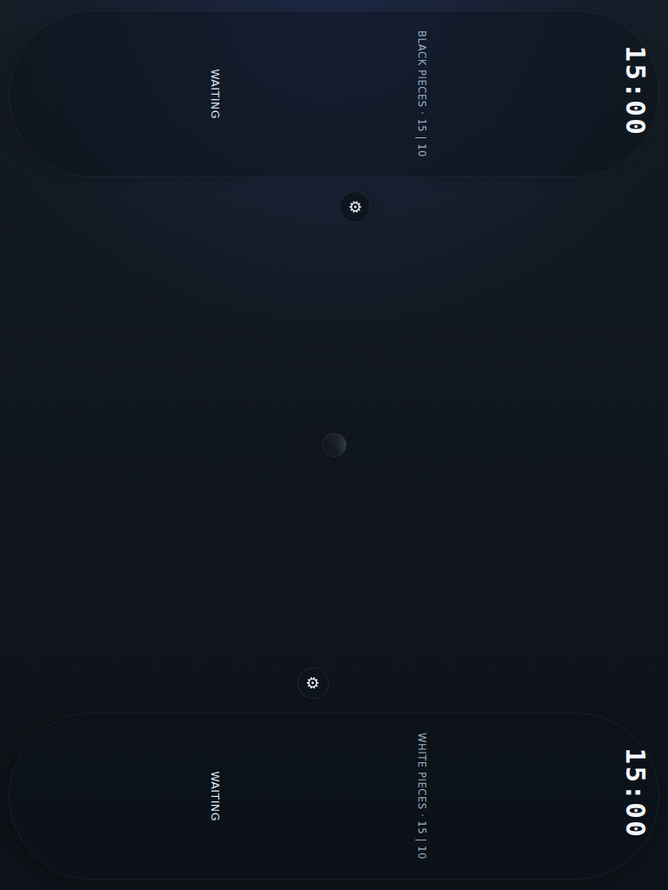

# MVP Board Selection

Verify that selecting a pawn highlights the legal destinations on the tabletop board.

## Selecting a Pawn Highlights Legal Moves

### Verifications
- [x] Two player-relative settings buttons frame the board from each seated perspective
- [x] Square coordinate labels are not rendered on the board
- [x] The selected square is marked as selected
- [x] The e3 and e4 targets are highlighted
- [x] Black pieces are oriented toward the top player
- [x] Pieces use the requested Wikimedia SVG rendering
- [x] The landscape layout fits the viewport without page scrolling
- [x] The clocks flank the centered board in landscape

## Portrait view rotates into a landscape tabletop arrangement

### Verifications
- [x] The rotated portrait layout still fits the viewport without scrolling
- [x] The board stays centered while the player clocks move above and below it on-screen
- [x] Both player settings buttons stay visible after the portrait rotation

