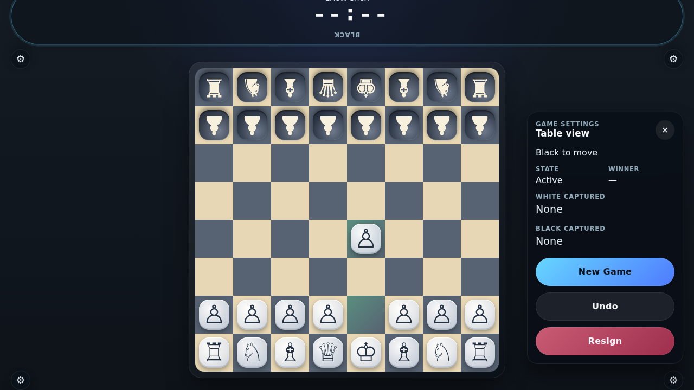

# MVP Move State

Verify that a legal pawn move updates the turn indicator, last move state, and undo control.

## A Legal Move Updates the Game State

### Verifications
- [x] The white pawn appears on e4
- [x] The white clock flips to waiting after the move
- [x] Undo becomes enabled inside the settings dialog

