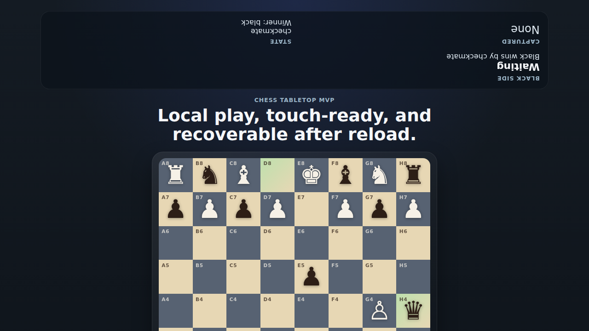

# Persisted Checkmate State

Verify that the event log in local storage restores a completed checkmate position after reload.

## A Persisted Checkmate Position Restores Correctly

### Verifications
- [x] The restored game shows the checkmate message
- [x] The black queen occupies h4 in the restored position
- [x] Resign is disabled because the game is complete

