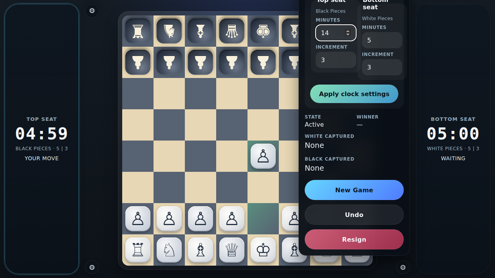

# Tabletop Time Controls

Verify that seat-based presets and custom time controls can be configured from settings and that the live clocks switch automatically during play.

## Custom seat times are applied independently

### Verifications
- [x] The top seat clock shows the longer custom time
- [x] The bottom seat clock shows the shorter custom time
- [x] The settings dialog exposes the tabletop seat labels

## Preset clocks switch and continue running after a move

### Verifications
- [x] The moving bottom seat keeps its full time and waits after the opening move
- [x] The top seat becomes active and begins counting down only after White completes move one

## Editing a time control stays stable while a live clock is running

### Verifications
- [x] The running top seat clock remains active while settings stay open
- [x] The in-progress top seat minute edit is preserved while the live clock is running

