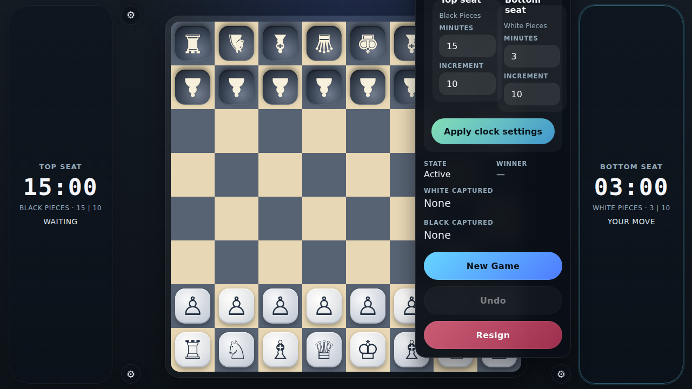
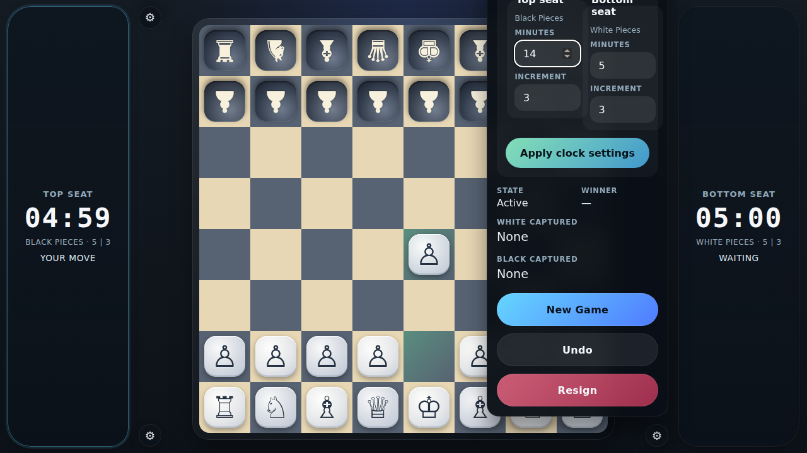

# Tabletop Time Controls

Verify that seat-based presets and custom time controls can be configured from settings and that the live clocks switch automatically during play.

## Custom seat times are applied independently

### Verifications
- [x] The top seat clock shows the longer custom time
- [x] The bottom seat clock shows the shorter custom time
- [x] The settings dialog exposes the tabletop seat labels

## The live clock handoff and settings editing stay stable after move one

### Verifications
- [x] The moving bottom seat keeps its full time and waits after the opening move
- [x] The top seat becomes active and begins counting down only after White completes move one
- [x] The in-progress top seat minute edit is preserved while the live clock is running

