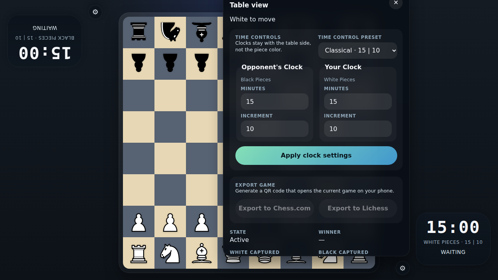
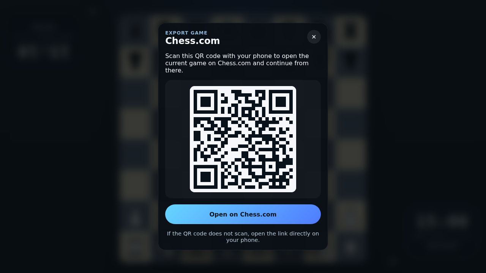
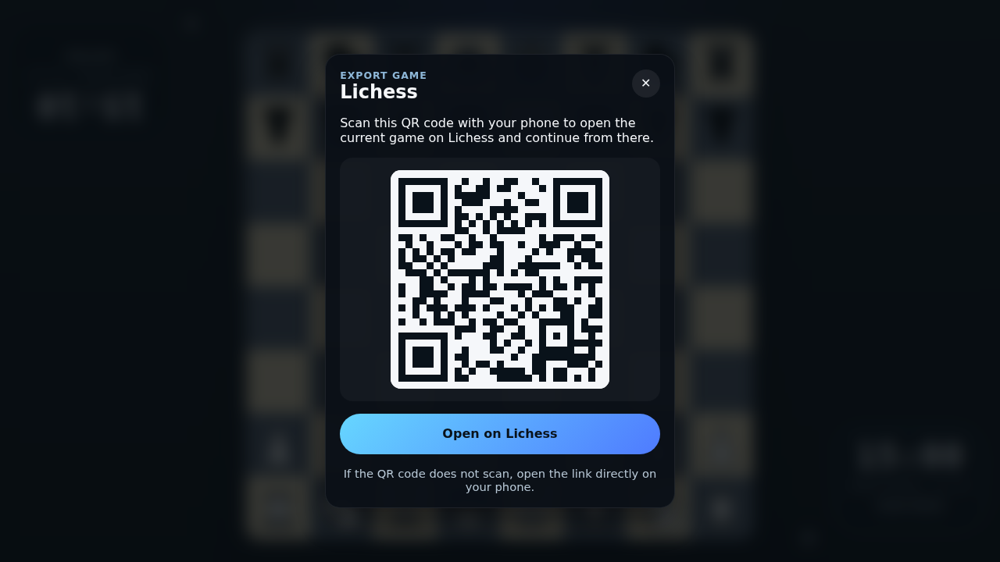

# QR Export Links

Verify that tabletop games can be exported as QR codes for Chess.com and Lichess from the settings dialog.

## Export stays disabled until the game has a move history

### Verifications
- [x] Chess.com export is disabled before any moves are played
- [x] Lichess export is disabled before any moves are played

## Chess.com export shows a QR code and matching link

### Verifications
- [x] The Chess.com export dialog renders a scannable QR code
- [x] The Chess.com export link encodes the current game PGN

## Lichess export shows a QR code and matching link

### Verifications
- [x] The Lichess export dialog renders a scannable QR code
- [x] The Lichess export link encodes the current game PGN

