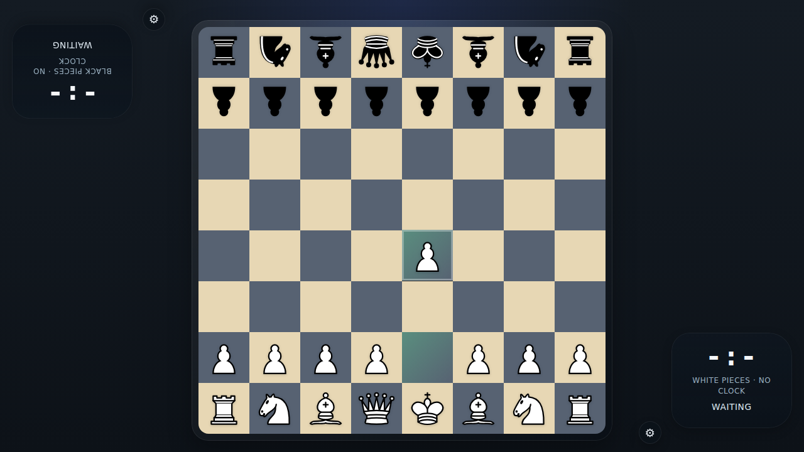

# No Clock Mode

Verify that selecting the No Clock preset leaves both tabletop timers frozen on the main screen during play.

## No-clock mode keeps both tabletop timers frozen after play starts

### Verifications
- [x] The top seat clock shows the no-clock placeholder and label
- [x] The bottom seat clock shows the no-clock placeholder and label

