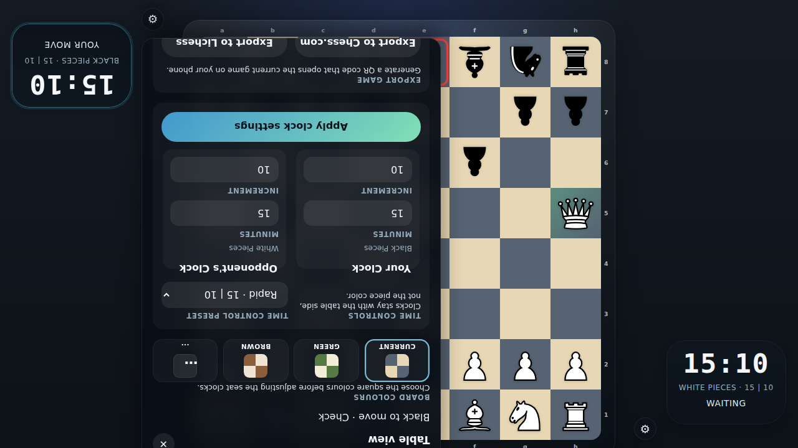

# Check Move Feedback

Verify that routine moves play a subtle click, checking moves play a deeper bong, and the checked king glows red.

## A Checking Move Uses the Check Tone and Highlights the King

### Verifications
- [x] The black king square is flagged as the checked king
- [x] The checking move updates the status copy to indicate check
- [x] Normal moves use the click tone while the checking move uses the deeper bong tone

