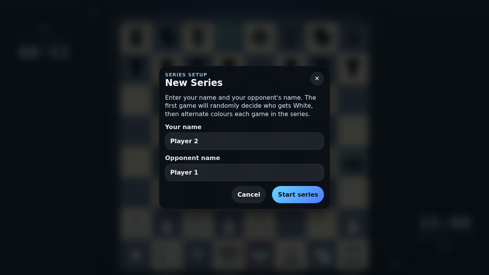
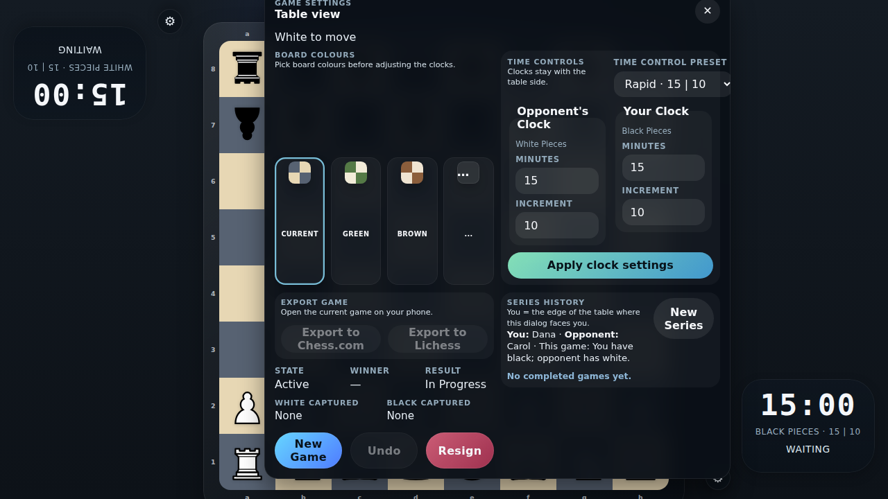

# New Series Reset

Verify that the New Series dialog uses You/Opponent labels, shows the randomized opening colour assignment, and clears completed history when a new series begins.

## New Series opens with the default player names ready to edit

### Verifications
- [x] The New Series dialog explains the random first-colour assignment and alternation
- [x] The dialog relabels the default players as You and Opponent for the invoking edge

## Starting a new series clears the previous results and returns export to its fresh state

### Verifications
- [x] The completed series history is cleared for the new matchup
- [x] The dialog shows the randomized opening colours for you and your opponent
- [x] Export is disabled again until the new series has recorded moves
- [x] The new series stores the updated Carol and Dana player names for later games

