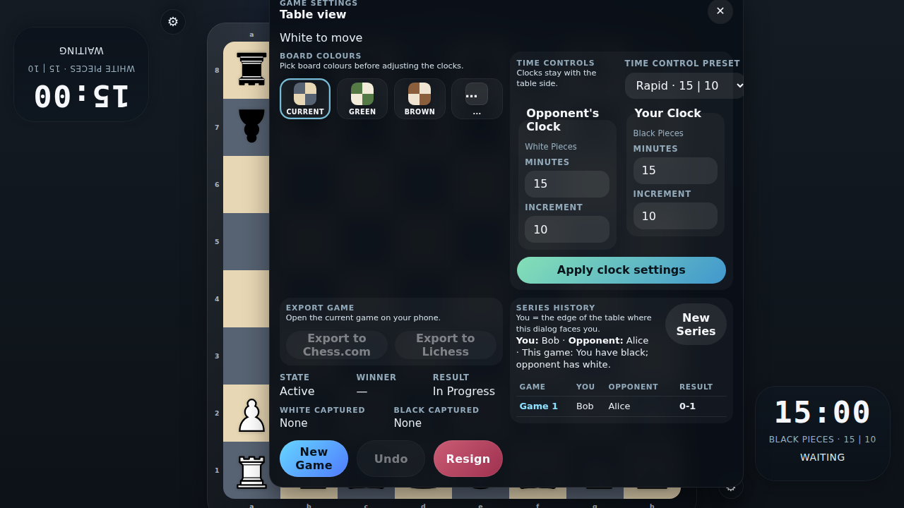

# Series Review and Export

Verify that completed series games remain listed in settings, that colors alternate for the next game, and that prior games can be reopened for export.

## Settings lists completed games while the next game flips White to the opposite seat

### Verifications
- [x] The second game gives White to the top seat and Black to the bottom seat
- [x] The prior games table records Bob versus Alice with the 0-1 result token

## A completed game can be reopened for board review and exported again

### Verifications
- [x] Selecting game 1 restores the archived checkmate position with the queen on h4
- [x] Exporting the reviewed game uses the archived PGN with its 0-1 result

